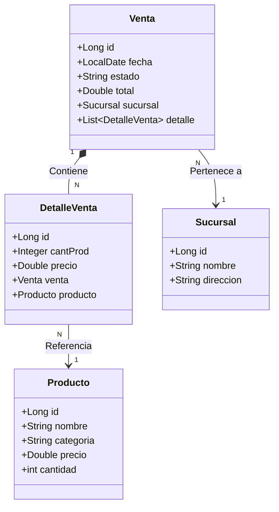
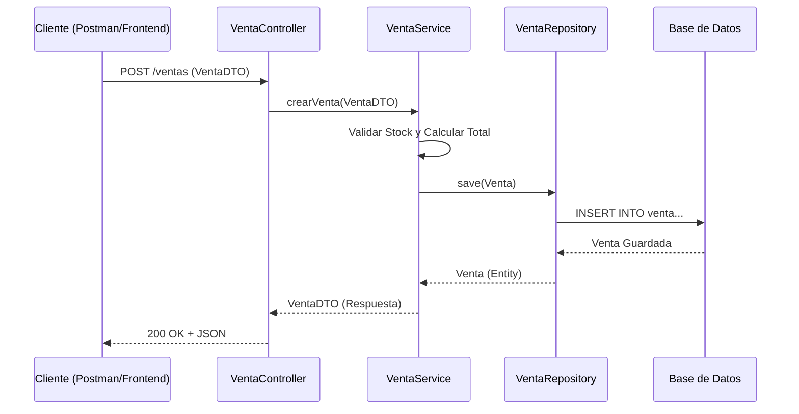

# 🛒 Supermercado Prueba Técnica

Bienvenido al repositorio del proyecto **Supermercado Prueba Técnica**. Este proyecto es una API RESTful desarrollada con **Spring Boot** para la gestión de ventas, productos y sucursales de un supermercado.

## 📄 Contexto: Prueba Técnica

El objetivo de este proyecto es resolver una prueba técnica que evalúa conocimientos en **Java + Spring Boot**, incluyendo el desarrollo de una **API RESTful** completa.

### 🎯 Objetivo

Desarrollar una API que permita digitalizar el sistema de control de ventas de una cadena de supermercados, implementando:

- Operaciones **CRUD** con **JPA**.
- **Relaciones entre entidades**.
- **Control de errores y excepciones**.
- Uso de **DTOs** y **buenas prácticas REST**.

### 📄 Descripción del Caso

Una reconocida cadena de supermercados desea digitalizar su sistema de control de ventas. Necesita una API que permita:

- Registrar productos con sus respectivos precios.
- Gestionar las sucursales donde se venden los productos.
- Registrar ventas realizadas en una sucursal, especificando los productos vendidos y cantidades.

---

## 🏗️ Arquitectura y Diseño

El proyecto sigue una arquitectura **MVC (Model-View-Controller)** clásica de 3 capas principales más la capa de persistencia.

### Diagrama de Clases (Entidades)

Relaciones entre las entidades principales del dominio:



### Flujo de Datos (Ejemplo: Crear Venta)



---

## 🚀 Tecnologías Utilizadas

- **Java 17**: Lenguaje de programación.
- **Spring Boot 3.5.7**: Framework principal.
- **Spring Data JPA**: Persistencia de datos.
- **MySQL / H2**: Base de datos (Configurable).
- **Lombok**: Reducción de boilerplate code.
- **Maven**: Gestión de dependencias.

---

## 🛠️ Instalación y Ejecución

1. **Clonar el repositorio:**

    ```bash
    git clone https://github.com/dasafo/Supermercado_SpringBoot.git
    cd SupermercadoPruebaTecnica
    ```

2. **Compilar y ejecutar:**

    ```bash
    ./mvnw spring-boot:run
    ```

    La aplicación se iniciará en `http://localhost:8080`.

---
*Documentación generada automáticamente basada en los recursos del proyecto.*
