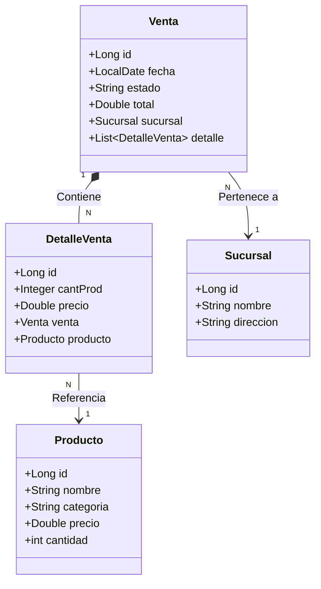
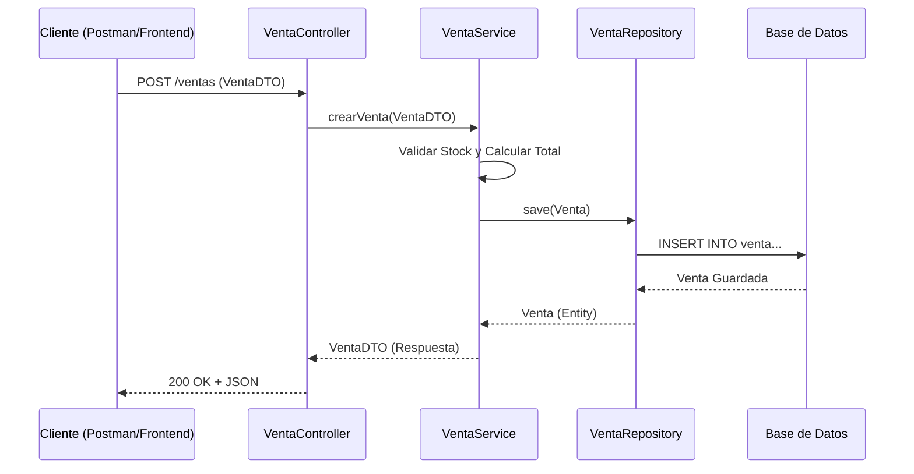

# Esquema del Proyecto: SupermercadoPruebaTecnica

Este documento detalla la arquitectura y estructura del proyecto, basado en el patrón **MVC (Model-View-Controller)** implementado con Spring Boot.

## 1. Arquitectura en Capas

El proyecto sigue una arquitectura clásica de 3 capas principales más la capa de persistencia:

1. **Controller Layer (`controller`)**: Maneja las peticiones HTTP (REST API).
2. **Service Layer (`services`)**: Contiene la lógica de negocio.
3. **Repository Layer (`repository`)**: Interactúa con la base de datos (JPA).
4. **Model Layer (`model`)**: Representa las entidades de la base de datos.

---

## 2. Diagrama de Clases (Entidades)

Relaciones entre las entidades principales del dominio:

### Explicación de Relaciones

* **Venta - Sucursal**: Una venta se realiza en una sucursal específica (`ManyToOne`).
* **Venta - DetalleVenta**: Una venta tiene múltiples líneas de detalle (`OneToMany`). La relación es fuerte (composición), si se borra la venta, se borran sus detalles (`CascadeType.ALL`, `orphanRemoval=true`).
* **DetalleVenta - Producto**: Cada línea de detalle referencia a un producto específico (`ManyToOne`).

---

## 3. Flujo de Datos

Ejemplo de cómo fluye una petición para **Crear una Venta**:

---

## 4. Componentes Detallados

### 📦 Controllers (API REST)

Ubicación: `com.dasafodata.SupermercadoPruebaTecnica.controller`

* **`ProductoController`**: Endpoints para gestionar productos (CRUD).
* **`SucursalController`**: Endpoints para gestionar sucursales.
* **`VentaController`**: Endpoints para registrar y consultar ventas.

### ⚙️ Services (Lógica de Negocio)

Ubicación: `com.dasafodata.SupermercadoPruebaTecnica.services`

* **`ProductoService`** (implementa `IProductoService`): Lógica de productos.
* **`SucursalService`** (implementa `ISucursalService`): Lógica de sucursales.
* **`VentaService`** (implementa `IVentaService`):
  * Cálculo de totales.
  * Validación de stock.
  * Creación de registros de `DetalleVenta`.

### 💾 Repositories (Acceso a Datos)

Ubicación: `com.dasafodata.SupermercadoPruebaTecnica.repository`

* Extienden de `JpaRepository` para operaciones CRUD automáticas.
* `ProductoRepository`, `SucursalRepository`, `VentaRepository`.

### 📄 DTOs (Data Transfer Objects)

Ubicación: `com.dasafodata.SupermercadoPruebaTecnica.dto`

* Objetos simplificados para transferir datos entre el cliente y el servidor, evitando exponer las Entidades directamente.
* `ProductoDTO`, `SucursalDTO`, `VentaDTO`, `DetalleVentaDTO`.

### 🛠 Utilidades

* **`Mapper`**: Convierte entre Entidades y DTOs.
* **`NotFoundException`**: Manejo de errores cuando no se encuentra un recurso.
